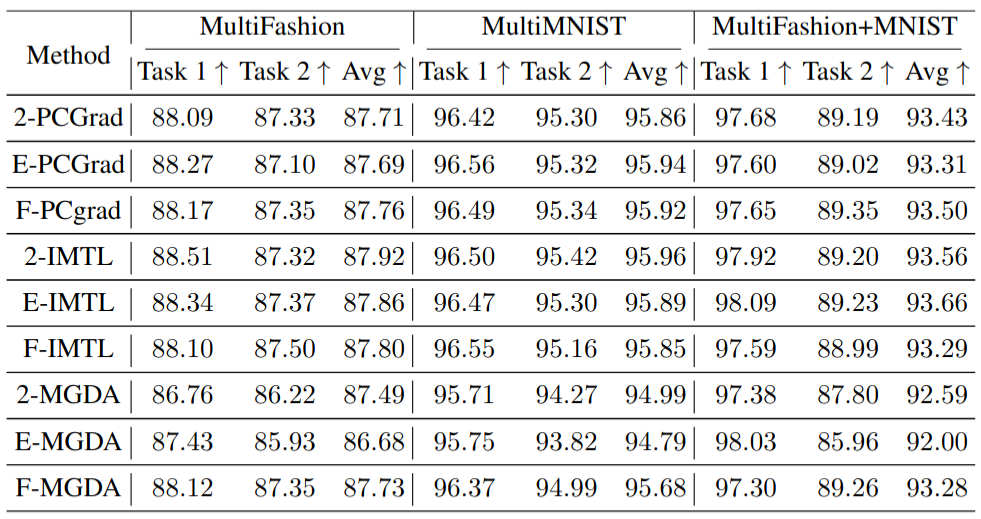

# Full additional results 

Here is the summarization for the additional experiments we conducted:
- More analysis on inter and intra conflicts.
- Fairer comparison with ERM in terms of time computation.
- More results on F-LS.
- Clarification on the direct summation of $g_{sh}^{loss}$ and $g_{sh}^{flat}$.
- P-values for MNIST variants experiments.
- Consistent ablations across benchmarks.

Figure 1. Inter conflict (upper) and Intra conflict (lower) on MultiFashion.

Figure 2. Evolutions of Gradient norm and loss on MultiFashion.

Figure 3. Trajectories of test accuracy along training time on MultiFashion.

Table 1. P-Values using Independent T-Test for the null hypothesis: Ours < ERM , on MNIST variants. These results suggest significant improvements of our method.

Table 2. Performance of LS and F-LS in CityScapes. 

Table 3. Performance of F-LS and LS in MNIST datasets. Compared with results in Table 1 from the main paper, the average accuracy of F-LS is only comparable with F-MGDA, our weakest method in these datasets.

Table 3. Two aggregation strategies on MNIST variants, showing the benefit of tackling intra-conflict.

Table 4. More ablation on second-aggre and each-aggre applied to other gradient-based methods. These results still align with out observation in the main paper.

